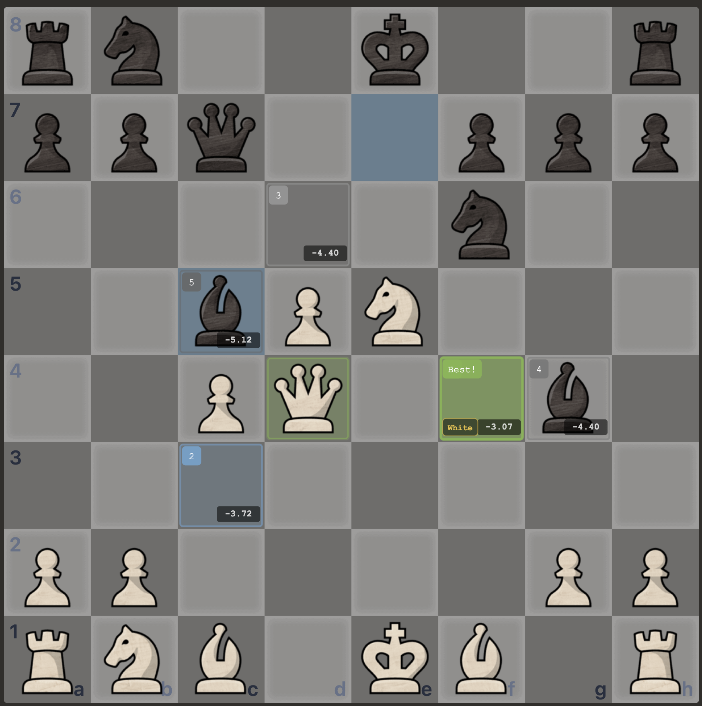
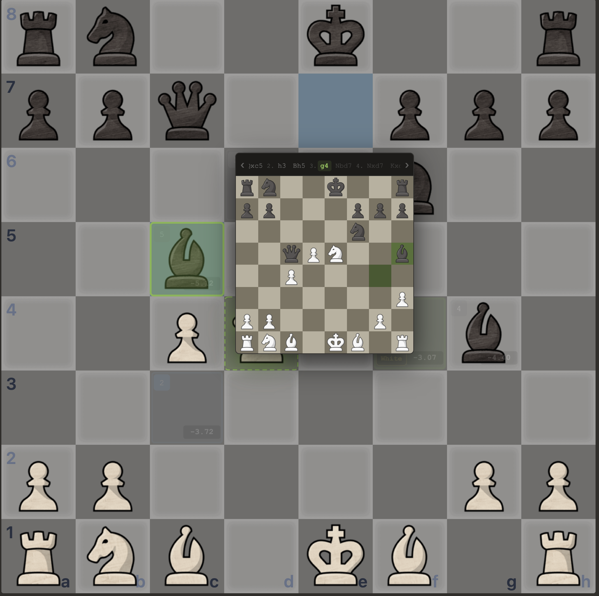

# NextChess

Chrome extension that overlays visual engine analysis on chess.com's analysis board.

Stop reading notation. Start seeing moves.




## What it does

NextChess reads the engine lines on chess.com's analysis page and highlights the moves directly on the board.

- **Green** square = best engine move
- **Blue** square = second best
- **Gray** square = third best
- **Red** squares = weakest engine suggestions (with rank like `4/5`)
- **Yellow chip** = what you actually played (White/Black)
- **Best! / 2** badge = when your move matches the engine's top picks

Hover any highlighted square to open a **mini preview board** that auto-plays the engine's predicted line with animated pieces and sound.

## Install

### From source

1. Clone this repo
2. Open `chrome://extensions` in Chrome
3. Enable **Developer mode** (top right)
4. Click **Load unpacked** and select the repo folder
5. Navigate to any chess.com analysis or game review page

### From Chrome Web Store

Coming soon.

## How it works

The extension runs content scripts on `chess.com/analysis/*` and `chess.com/game/review/*` pages. It:

1. Reads the current FEN position from the page DOM
2. Reads engine lines from chess.com's Stockfish output
3. Resolves SAN notation to source/destination squares
4. Draws SVG markers on the board (background layer behind pieces, foreground layer above pieces for badges/scores)
5. Polls every 500ms for position changes, with a 1.5s settle timer for engine stabilization
6. Caches settled positions (up to 200) for instant back/forward navigation

No external servers. No data collection. Everything runs locally in your browser.

## Features

**Board overlay**
- Color-coded destination squares with rank badges and eval scores
- Source square highlighting for the best move
- Castling-aware: highlights all 4 squares (king + rook paths) with rook icon
- Worst-move markers (bottom 2 engine lines) shown in red with rank indicators

**Played move detection**
- Reads the game's move list to show what was actually played at each position
- "Best!" pulse animation when your move matches the engine's #1
- Rank badge ("2") when it matches the second best
- Only shows on main line moves (hides when you enter a variation)

**Preview board**
- Hover a highlighted square to see the engine's full predicted line
- Animated piece sliding with chess.com's own piece images
- Move and capture sounds
- Clickable move bar with left/right arrows to step through positions
- Keyboard controls: arrow keys to navigate, space to play/pause
- Preview stays open when you move your cursor to it

**Performance**
- Position cache for instant back/forward
- Minimal thinking indicator (pulsing dot) while engine calculates
- No animation during loading — board stays clean when clicking through moves quickly
- 300ms hover intent delay prevents accidental preview popups

**Integration**
- Native chess.com toggle switch next to the Analysis toggle
- Uses chess.com's piece images and board theme
- Respects board flip state

## Architecture

```
content/
  chess-utils.js     — FEN parsing, SAN-to-square resolution
  dom-reader.js      — Reads engine lines, FEN, played move from chess.com DOM
  board-overlay.js   — SVG markers, hover zones, thinking indicator
  preview-board.js   — Mini board popup with animated playthrough
  content.js         — Main orchestrator: polling, settle logic, caching
styles/
  content.css        — Overlay animations, preview board styling
popup/
  popup.html/js      — Settings (API key, model, lines to show)
background/
  service-worker.js  — Claude API bridge (currently unused)
```

## Tech

- Vanilla JavaScript, no dependencies, no build step
- Chrome Extension Manifest V3
- SVG for board overlays (two layers: background behind pieces, foreground above)
- CSS animations for fade-in and pulse effects

## License

All rights reserved. Source code is available for reference but may not be redistributed or used commercially without permission.
